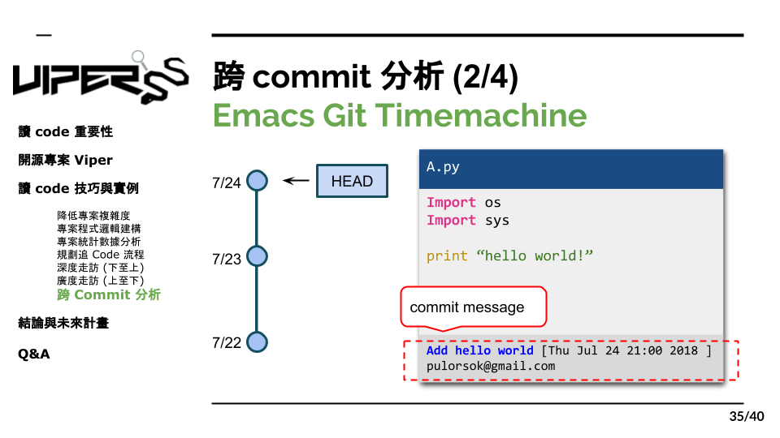

# 8.2 搭乘 git 時光機 1

這裡我們舉個範例，上圖是A.py的程式碼，有三個commit，最上方是最新的版本，那在用了這個工具搭配emacs的編輯器後我們就可以查看他在當下這個 commit 的資訊，包括了訊息、時間、跟、撰寫人的user id , 那我們可以發先這個版本的 message 是"add hello world"，因此我們就可以猜想他這個版本可能就是新增print hellow world 的這個功能，再來我們可以用它的走訪功能，去觀看每個commit的狀態，並觀差他們的變化。
