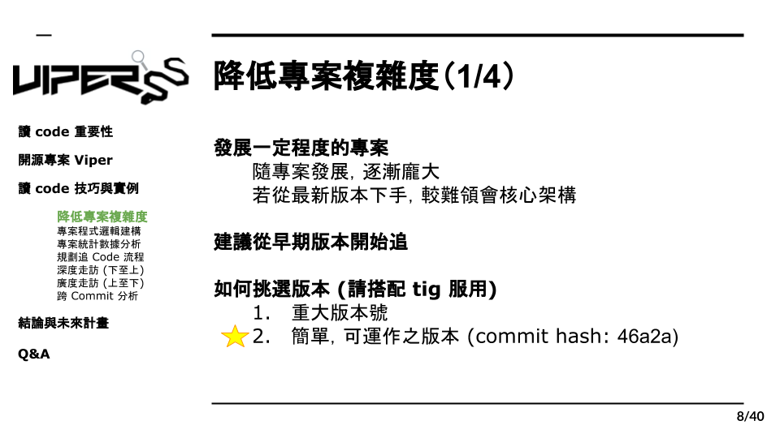

# 2.1 早期版本挑選

在我們找到了想要研究的專案後，想必大家都是充滿熱誠充滿鬥志，但在開始翻閱程式碼幾分鐘後，你開始不知要從何讀起，光是看到龐大的目錄和天書般的程式碼頭就痛了起來，畢竟程式專案不是用來讓人閱讀的，雖然在設計實作時會有一定的架構和邏輯，但是也只有該專案的設計者才會完全了解整個架構，所以當我們在閱讀別人的專案時，勢必需要做一些準備和規劃。

首先，我們會遇到的第一個問題是：專案程式碼太龐大，不知從何讀起。
一個在 Github 上優秀的專案，一定會時常的更新優化，並隨著時間推進增加許多功能，因此整個專案也會越來越龐大。然而，並不是所有的功能都是專案的核心，有些可能是美化介面、效率優化或是錯誤偵測等等，這些在程式專案中當然重要，但未必是你想要了解的部分，你想研究的也許只是這個系統的最主要功能，例如我們選擇的 Viper ，他的主要功能就是惡意程式的分析，而我們想知道的，是它分析的方法和核心模組。也因此，在開始讀 Code 前我們需要將不必要的部份去除掉，以增加我們讀 Code 的效率。

在這ㄧ階段我們建議，不必一開始就急著找出多餘的程式碼，而是先從版本下手。前面我們有提到“專案會隨著時間逐漸龐大”，核心的功能通常是先行開發，後續才加入額外的功能，而我們只需要選擇較早期的版本，就能夠減少大部分的的程式碼，除此之外，早期的版本架構也會相對簡單，閱讀上也比較容易。

一般來說，Github 的專案都會有 Git commit，他能夠讓開發者紀錄每次編輯，同時加入註解，一個維護良好的專案，Git commit 的管理也會非常完善，而我們就能透過這點去檢索 git log 找出適合我們的版本， 這裡我們提供一個建議：觀察 Git commit 中，有無標注版本號例如：Viper v1.1。通常這些commit都是作者的一次重大更新，架構上也會比較完整。除此之外，我們也可以試著挑選一些版本去觀察，當你發現該版本的程式碼相對簡單並且可以正常運作，那或許這個版本就是適合作為研究的起點了。
