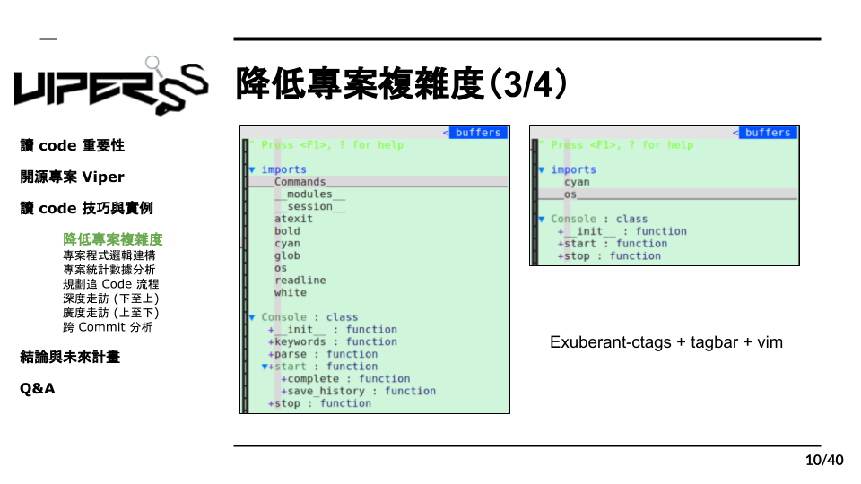

# 2.3 砍功能實例 1

上圖是 Viper 中 Console 類別的定義，我們所使用的編輯器是 Vim 加上 Exuberant-ctag 和 tagbar 的套件，所以在檢閱程式碼時就能很快地看出它的結構，例如該程式 import 了哪些模組，定義了哪些 Class 以及 Function，利用這種瀏覽目錄的方式我們能更有效的刪除多餘的程式碼。

你可能會問，這樣的話根本看不出 Function 內的程式碼，如何判斷要刪掉哪部分？其實不需要，我們只要透過 Function 的名子去猜測它的功能後在經過測試，就能找出多餘的那部分。
以上圖的例子來說明，在 Console 中有以下幾個 Function，包括：keywords、parse、start、complete、save_history、stop。透過它們命名我們可以推測
* keywords：關鍵字相關的功能
* parse：分析字串
* start：開始
* complete：完成時的動作
* save_history：儲存歷史紀錄
* stop：停止

有了這些 Function 的功能假設後，我們要挑選出“功能正常運作時必須執行的程式碼”，也就是該功能不可或缺核心，舉例來說，如果 Console 要正常運行，在以上的 Function 中必須有開始和停止這兩部分，而其他諸如關鍵字和歷史紀錄等等，則是較額外的功能，這時候我們假設 start 和 stop 就是該程式的核心，這樣一來其餘的 Function 就能視為是可刪除的。但這畢竟是假設，必須經過驗證測試才能確保刪除後不會影響正常功能的運作，而測試方法非常簡單，只需要將 Function 刪除後執行一次，就能馬上知道結果；如果主要功能正常能夠運行，那這一次的過濾就算是成功了。
