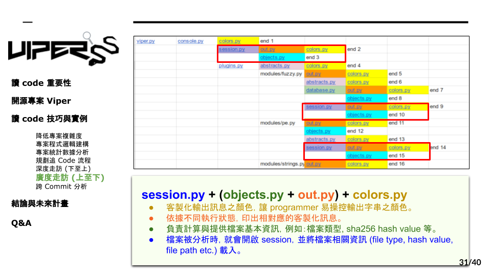

# 7.2 積木組合實例



那接下來就是實作的部分，我們可以看到剛剛的表格，可以發現當中有些特定積木的組合經常被使用，那我們就先分析他們。首先，把它拆解有四個組成，sesssion object out colors，因為在第二輪已經把積木的所有功能都寫好筆記了，藉此可以參考先前的紀錄，觀察以下這些module的功能，
```
Session.py : 當檔案被分析時，開啟Session並載入相關的當按資訊
Object.py : 負責計算與提供檔案基本資訊
Out.py : 依據不同執行狀態，印出相對應的客製化問題
colors.py : 客製化輸出文的顏色
```
讓四個積木組合起來後就可以推測出這些module的功能了。
