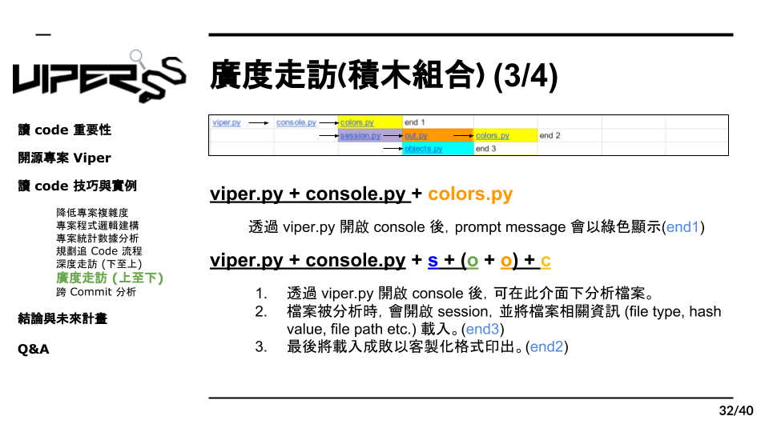

# 7.3 積木組合實例 2

 在我們分析完積木組合後，就可以開始周遊列國了，這邊就舉最前面三條路線當作範例，首先我們第一條路可以發現他經過了 viper console colors, 那這條路在做些什麼事，我們發現當我成功開啟viper的console介面後，他就會prompt 出綠色的message，像這樣用一句話的方式把這條路的作用寫成筆記。

那接來第二條，我們發現除了viper跟console其他就是我們剛剛所分析的積木組合，那我們已經知道這個組合的功能，我們就可以很快地了解這條路在做什麼，也就是我們開啟viper後分析檔案然後印出檔案資訊。那第二條路的功能就完成走訪了。
