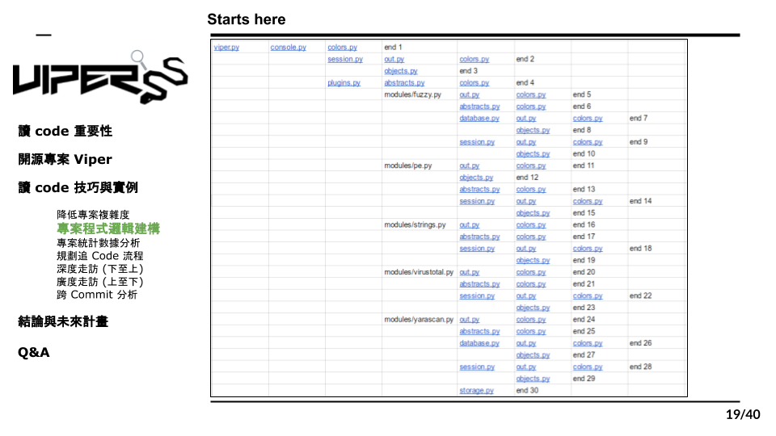

# 3.8 程式邏輯建構結果

上圖的excel表格是我們彙整的結果，在表格最上方的是viper.py也就是整個專案的起點，而在最右側所標註的”End“則是終點。接著，從這張表格中我們可以發現，有部分的module被執行非常多次，比如”color“或是”out“出現的頻率比其他的module高出很多，為了分析這個現象，我們把所有module被import的次數做一個統計，來看看有什麽樣的線索。
