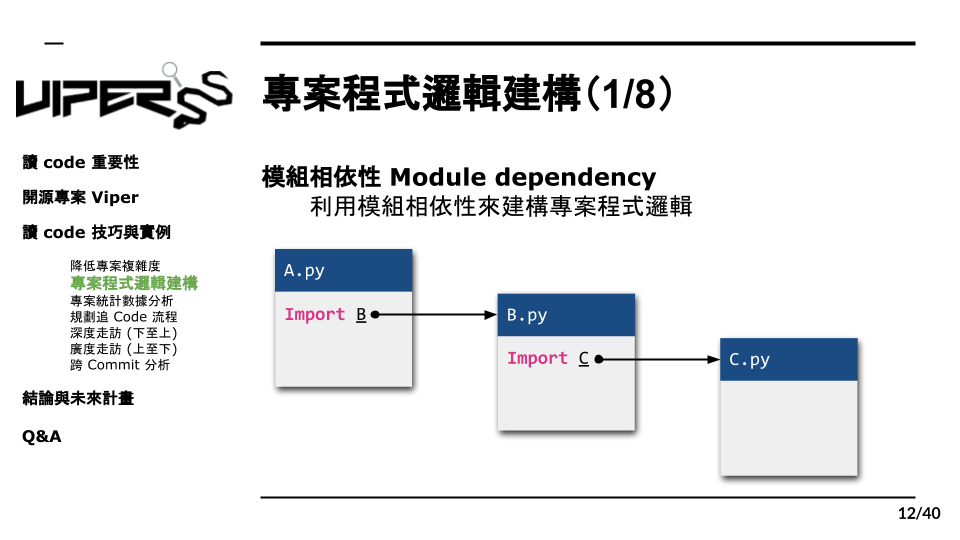

# 3.1 模組相依性定義

那在我們過濾完程式碼之後，進入第二步驟專案程式邏輯建構，我們要利用python的模組相依性Module Dependency，來建構出專案的股價，那什麽是模組相依性，這邊就舉個例子 ，我們寫了三隻程式，a b 跟 c，我們讓a import b import c，想這樣的import關係，就是模組相依，利用這點我們就可以找出專案的架構。

再過濾完多餘的程式碼後，下一步我們要利用Python的模組相依性 ( Module Dependency ) 建構出整個專案的架構，而在這之前，需要先定義什麼是“模組相依性”，我們假設了上圖的案例來說明。我們定義了三個 python 模組，包含了A.py，B.py與C.py，且 A.py 中 Import 了B.py 則 Import 了 C.py，如此一來就形成了一個簡單的結構，而這樣子的結構就可以稱作模組相依性。
