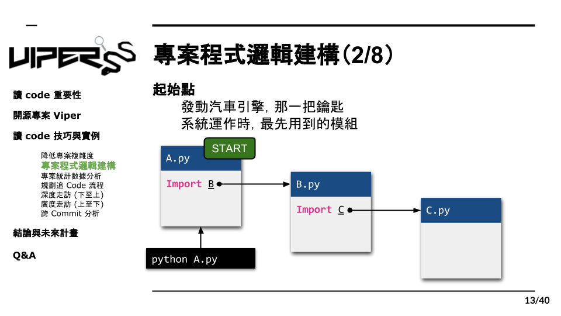

# 3.2 追 Code 起始點

理解了模組相依性的定義後，我們需要找出一個專案的起點與終點，這有助於我們去理解此專案的邏輯架構，也可以作為後續讀 code 規劃的參考。
首先，我們要找出專案的起點，我們將起點定義為，系統運作時，會最先執行的模組。起點就像是發動汽車引擎的那把鑰匙，是啟動專案的關鍵。
以我們剛才提出的案例解釋，假設我們執行 A.py ，而因為 A.py import 了 B.py ，所以 B 也順勢運作起來，並且因為B import 了 C 所以也帶動 C 一起執行。很明顯的，在這個例子中 A.py 就是這個專案的起點了。
