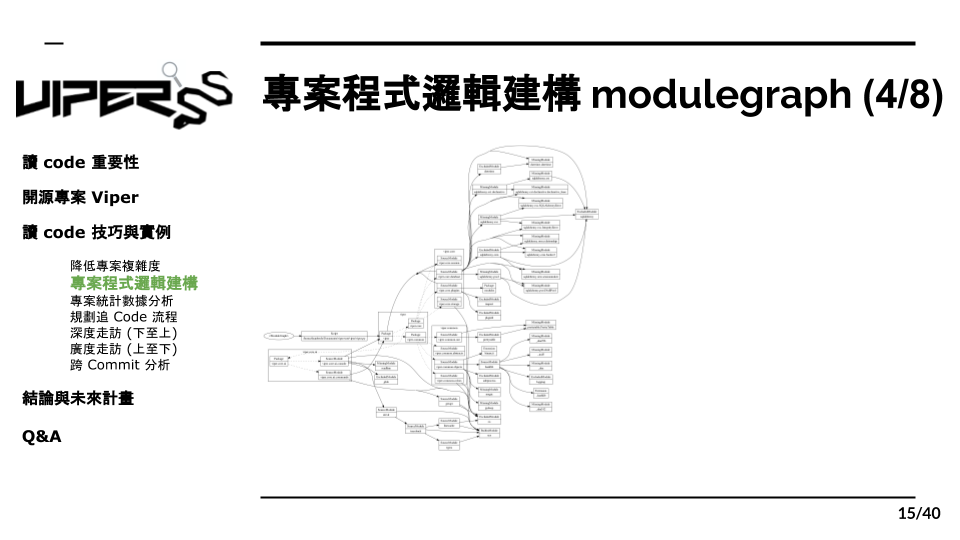

# 3.4 自動化工具 modulegraph

到目前爲止，我們已經對模組相依性和專案結構有了基本的了解，接下來就是實際動手把整個專案架構描繪出來。但是，通常一個有善的專案都具有一定的規模，要用人工的方式一層層的把架構描出來是非常繁瑣且花時間的工作，而我們身為工程師，就要懂的使用工具去幫我們達成這些任務。下面介紹了一些我們在實作 Viper 追 code 時所用的一些專案架構工具。

首先，我們找到的第一個工具是“Modulegraph”，而在使用後我們雖然成功地畫出整個專案架構，但可以看得出來整張圖非常雜亂，所有的線都擠在一起，完全看不出各個module的關聯性，所以想當然而，這支工具並不是我們所要的，只能繼續尋找其他適合的工具。
