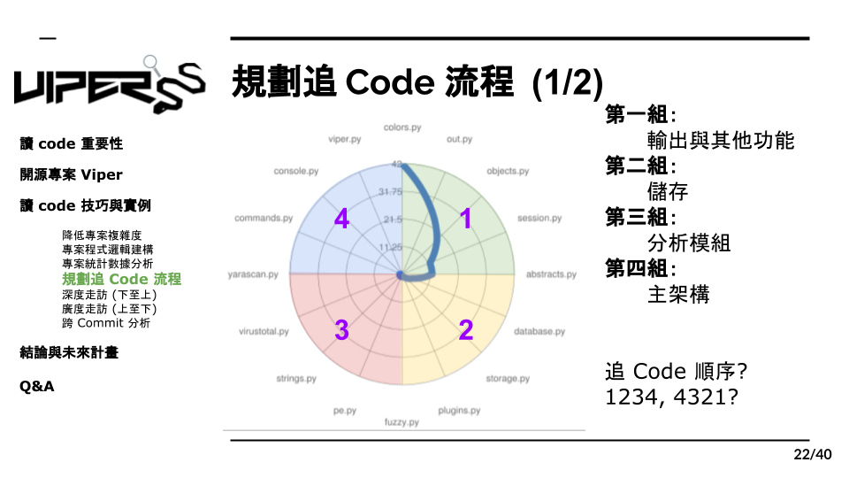

# 5.1 規劃追 Code 流程 1

除了發覺小工具，我們還可以利用剛剛的數據再來做一項流程規劃的分析，將這些Module依照Import的次數從最上放並順時針排序下來，然後畫成像上方的圖表，而這時我們發現，在這個案例中他剛好組成了四個分類，每個分類的程式碼都負責某項特定功能，比如說第一類別的程式就負責輸出的控制，第二類別是儲存控制，第三是分析模組，第四是主架構。而有了這些分類後，我們就可以著手規劃讀Code的順序了，那麼問題來了，我們的順序應該是1234或是4321呢？
