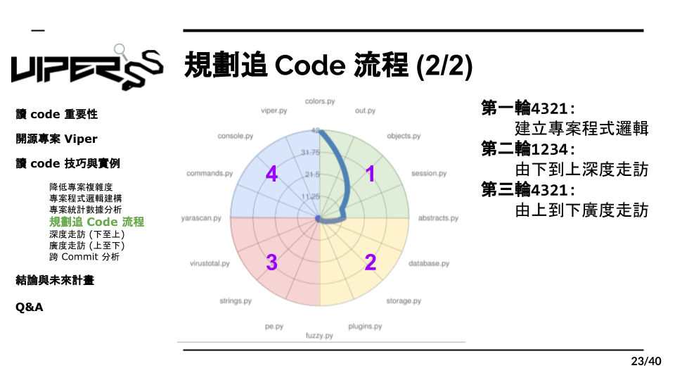

# 5.2 規劃追 Code 流程 2

而我們建議兩個方向都要做，而且還有走三輪，當然我們走的每一輪都有他的目的在，首先第一輪，我們要從上到下起點到終點的方式找出專案架構，再來第二輪要逆回去bottom up的方式做深度走訪我們要研究每隻module的功能，最後要在top down的方式做廣度走訪，把每隻module都串起來，研究他們之間的關係。這樣三輪走完後我們也就將這個專案完全摸透了。
