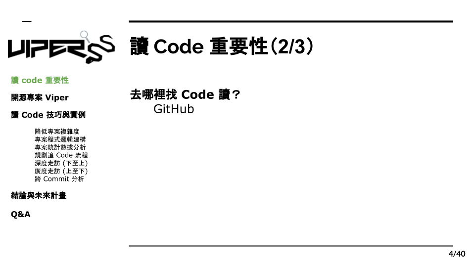
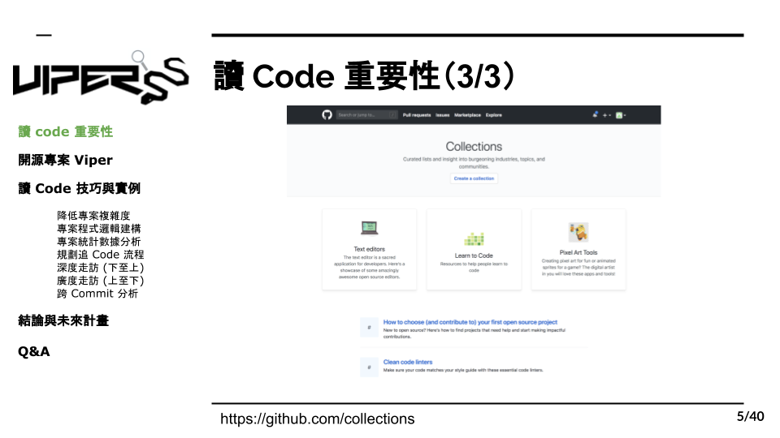

# 1.2 哪裡找 Code 讀？

在我們了解了讀 code 的重要性後，下一步就是選擇一個程式專案來研究了，而我們可以利用網路上大量的資源去尋找；Github，是一個提供工程師分享開源碼的網站，除了讓工程師們做專案版本的控管，也能將自己寫的程式放在上面分享，而我們可以從上面找到許多優秀的程式專案來學習。除此之外，Github 也提供了分類功能，包括不同程式語言，類型和功能，利用這些分類，我們就能快速的找到自己有興趣想研究的程式專案。
