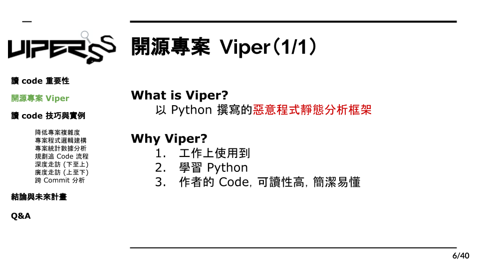

# 1.3 開源專案 Viper-framework

在本書中，我們會以 Viper 作為實際的範例來說明在研究一個專案的流程和方法。首先，Viper 是一個用 python 撰寫的惡意程式分析框架，由於筆者的工作是資安工程師，所以在工作中時常會需要使用惡意程式分析的工具，而選擇 Viper 當作研究專案，一方面去可以更精進 python 的撰寫能力，又可以了解惡意程式分析的原理，也算是一舉多得。
在挑選要閱讀的專案時，讀者們可以鎖定自己本身有興趣，或是與工作相關的領域，如此一來，讀 code 就不僅僅只是了解“別人怎麼寫”這麼簡單了，透過觀察他人的程式，我們可以清楚地理解在實作該流程時的所有步驟和方法，因為程式語言不像自然語言，同一句話可能有不同意思，在程式語言中，工程師寫什麼電腦就會做什麼，所以只要夠有耐心仔細研究觀察，即使在複雜的原理再難懂的邏輯都能夠掌握。
